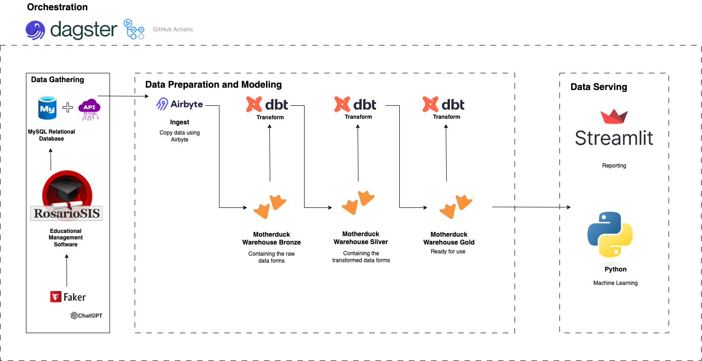
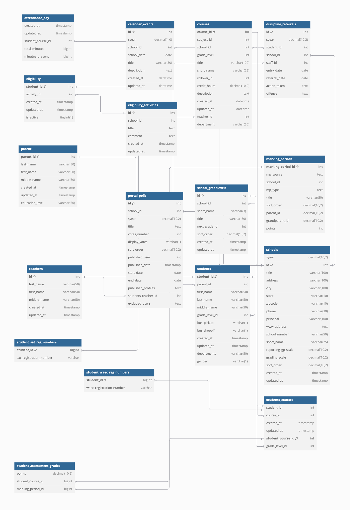
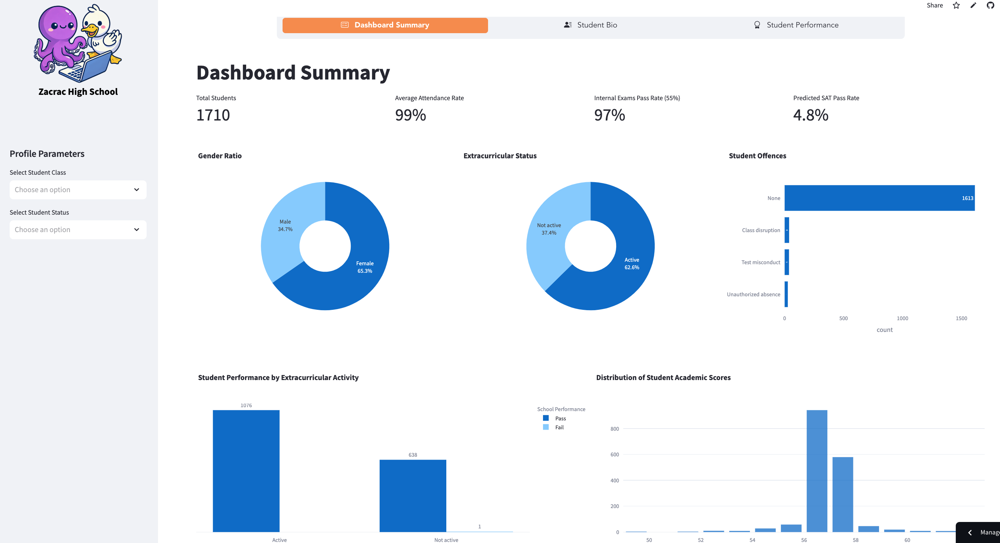
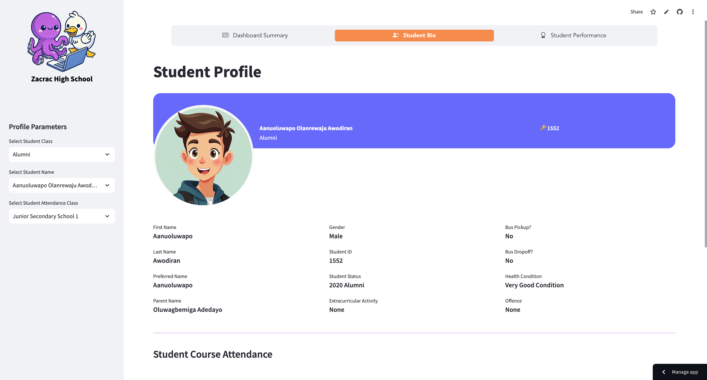
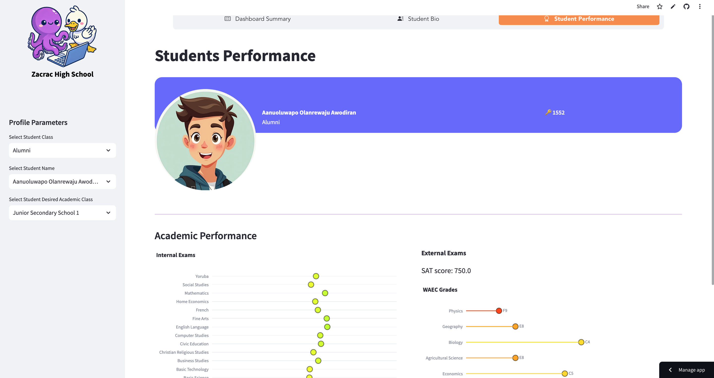

# Project Documentation

This project is an end-to-end solution built by the Data Baddies team for the Airbyte Motherduck 2025 Hackathon comprising of [Olaminike Olaiya](https://www.linkedin.com/in/olaminike-olaiya-821b66224/), the data scientist, and [Nancy Amandi](https://www.linkedin.com/in/nancy-amandi/), the data engineer.

[LINK TO DEMO VIDEO](https://drive.google.com/file/d/1jqEteth7NV3Wy1gaOBzPsG9iAcVFfNQN/view?usp=sharing)

[LINK TO PROJECT INTERFACE](https://airbytemotherduckhackathon-databaddies.streamlit.app/)

# Problem Statement

Zacrac High School, a secondary school (High School) in Lagos, Nigeria, wants to improve the performance of their students by tracking students' metrics including their past performances in Internal (school assessments) and External exams (Scholastic Aptitude Test (SAT) by the College Board and West African Senior School Certificate Examination (WASSCE) by the West African Examinations Council (WAEC) board) to enable predictions of students' performances in their upcoming external exams.By predicting exam scores, they plan to implement targeted recommendations and adjust school activities to improve future outcomes.

Upon reviewing their request, it became evident that the school also faces a significant challenge with data collection. Their records are scattered across various locations in paper formats, and no central electronic system is in place.

This is where the Data Baddies team steps in! We’re excited to guide Zacrac High School on its journey to solving these problems. Stick with us as we walk you through our process and solutions. We're excited to show you how we tackled this—let’s get started!

# Importance to the Education Industry

- **Improved Student Outcomes:** Predictive analytics can identify students at risk of underperforming, allowing for timely interventions that enhance overall academic achievement.

- **Personalized Learning:** Analyzing individual learning patterns enables the development of customized educational experiences tailored to each student's strengths and weaknesses.

- **Informed Decision-Making:** Data-driven insights assist educators and administrators in making strategic decisions regarding curriculum development, resource allocation, and instructional methods.

- **Early Identification of Trends:** Predictive models detect emerging patterns in student performance, attendance, and engagement, allowing schools to address potential issues proactively.

# Solution Approach

- Data Gathering: MySQL database behind the Rosariosis Software, APIs

- Data Ingestion: Airbyte

- Data Storage: Motherduck

- Data Preparation and Modeling: dbt

- Machine Learning: Python

- Reporting and Visualization: Streamlit

- Pipeline Orchestration: Dagster

While choosing this solution approach and the tools involved, we considered several factors:

- Cost-effectiveness: We understood that this was a High school so most of the tools used has open source versions where the school didn’t need to pay for subscription fees. These included: Rosariosis software, Airbyte, dbt, Dagster.

- Scalability: To aid scalability, we needed to orchestrate all the processes involved. Hence, we chose to use an orchestration tool. In addition, to solve the problem of recording data for the school, we setup a software so that they won’t need to use paper data records anymore. This approach also aids our data ingestion process for the data pipeline.

- Data volume and velocity: For a secondary school, it is expected that data points are recorded at least five times in a week. This prompted us to use a data ingestion tool (Airbyte) to capture all data generated in the school.

- Business requirements: It is required that the school should be able to predict students’ scores in upcoming exams so a visualization tool was used to aid this process.

- Data formats: Because the raw data was already in a structured format, we chose a warehouse (not a data lake or lakehouse) to store the data.

- No complex transformation involved: There were no complex transformations involved in the data processing so we chose to use dbt that is built on the basis of SQL.



## Data Gathering

### MySQL Database Data Source

Setting up the Rosariosis software automatically created tables in the linked MySQL database before we went forward to generate pseudo data using a combination of ChatGPT and the Python Faker Library. 

These tables gave us the basis of the kind of information needed in a secondary school. However, because these tables were many and more than 80 tables, we decided to use some tables that were relevant to this project. Our choice of tables was mostly associated with the day-to-day activities of the school.

Below is the list of tables we chose and their short descriptions:

- attendance_day: Contains the attendance of students

- calendar events: Contains events and public holidays that the school hosted or participated in

- courses: Contains the subjects offered in the school

- discipline_referrals: Contains offenses and punishments of delinquent students

- eligibility: Contains the eligibility of students as regards extracurricular activities

- eligibility activities: Contains the extracurricular activities of students

- marking_periods: Contains the periods at which students are assessed. Eg. First term Midterm test

- parent: Contains the list of parents that have children in the school

- portal_polls: Contains the voting polls of students in evaluating their teachers

- school_gradelevels: Contains the different classes in the school. In this context, JSS1 to SS3

- schools: Contains a list of schools. In this context, only one school (Zacrac High School) is in the table.

- student_assessment_grades: Contains the grades of the assessments taken within the school

- student_sat_reg_numbers: Contains the SAT registration numbers of the alumni

- student_waec_reg_numbers: Contains the WAEC registration numbers of the alumni

- students: Contains students and their information in the school

- students_courses: Contains students and the courses they studied and/or are studying.

- teachers: Contains teachers in the school

It is important to note that some of these tables were added manually for the sake of this project. The tables include student_sat_reg_numbers and student_waec_reg_numbers. 

The image below is the Entity Relationship Diagram between the tables in the database.



To further explore the tables and their relationships in the diagram, you can visit [this link](https://dbdocs.io/amandinancy16/OLTP-ERD-Diagram-Airbyte-Motherduck-Hackathon)

### API Data Source

We understand that the student scores of the SAT and WASSCE can be accessed by the APIs provided by the College Board and WAEC respectively. However, because of data privacy issues, we decided to improvise and generate the pseudo data and make it accessible publicly via APIs.

These APIs acted as our second data source for the project. You can access the documentation of this API [here](https://airbyte-motherduck-hackathon.onrender.com/docs).


## Data Ingestion

Data was ingested using the cloud version of Airbyte. Fortunately, the Airbyte team extended the free trial because of this hackathon. 

We utilized the following Airbyte sources to copy data into the Motherduck destination:

- MySQL source (comprising 17 streams)


- Airbyte connector builder to build a custom source that made requests to the SAT score APIs (comprising 3 streams).


- Airbyte connector builder to build a custom source that made requests to the WAEC score APIs (comprising 3 streams).


## Data Storage

Motherduck was used as the warehouse due to the structured format of the raw data. It consisted of the raw, intermediate, core, and exposures schemas. 

The raw schema contains raw tables copied from the transactional database and APIs to the warehouse. The intermediate schema contains the transformed forms of each of these tables. The core schemas contain tables that were as a result of re-modeling or joining with other tables in the intermediate schema. The exposures schemas contains the two aggregate tables that were used for the machine-learning and data analysis process.

**Below is the Motherduck Instance:**

```sql
ATTACH 'md:_share/Airbyte_Motherduck_Hackathon/6905c599-cdac-4252-9891-3acb2ba3c404';
```

## Data Preparation and Modeling

The tables in the Snowflake intermediate, core, and exposures schemas were built using dbt, our transformation tool. The major data preparation techniques used were:

- Dropping of duplicates

- Handling null values

- Casting columns to suitable datatypes

- Derivation of some columns

- Joining some tables into one table

- Generation of dates dimension table to aid analysis

- Dropping irrelevant columns

- Creating the SAT ML Data (sat_performance_metrics table) and WAEC ML Data (waec_performance_metrics table) by joining several relevant tables for data analysis and machine learning purposes


## Machine Learning

When the data was ready in our Motherduck warehouse, we moved into the predictive phase of the project. We aimed to proactively predict student performance in the final external exams by analyzing alumni's and current students' academic records. With this insight, Zacrac High School could implement targeted recommendations for current students, helping to improve future exam outcomes.

## Reporting and Visualization

When it came to presenting our insights in a way that Zacrac High School’s teachers could easily use, we knew it had to be simple, cost-effective, and impactful. That’s why we chose Streamlit for our reporting and visualisation needs. It's open-source, user-friendly, and importantly for a secondary school budget-friendly. This ensured we could deliver a solution that was not only powerful but also sustainable for the school in the long term.

We developed three dashboard pages tailored specifically for class teachers to navigate, generate reports, and gain valuable insights into their students' academic journeys.

### Dashboard 1: Dashboard Summary



### Dashboard 2: Student Bio



### Dashboard 3: Student Performance and Predictions



## Pipeline Orchestration

To ensure that the processes of copying data from source tables to the destination warehouse, transforming the data, and even the machine learning building process are continuous, we integrated pipeline orchestration into this project. 

This is important to deliver fresh data and fresh insights to our stakeholders. Using Dagster, we enabled a CI/CD pipeline that deploys changes in our GitHub repo code to the Dagster application which then updates our pipeline. 

## Value Generated

In this project, we were able to provide the following value to our client secondary school:

- **Effortless Data Collection:**

We provided a central system, Rosariosis, where this school can manage their school data and have no extra data outside this system. The data in Rosariosis is written to a database where anyone can access the data provided they have the permissions. We also made it possible to access data for external exams from APIs. 

Airbyte, a reliable data ingestion tool with versatile integrations was used to copy the data into the destination. This choice is scalable in cases where other data sources might spring up in the future.

- **Scalable Data Warehousing System:**

We used Motherduck, a warehousing system that would power our machine learning predictions and reporting.

- **Precision-Optimized Machine Learning:**

We built a machine learning model that predicts students' performances. We call it Precision-Optimized because in our pipeline, any predictions that have accuracy score below 60% won't be written to our output table in the warehouse.

- **Personalized Reporting:**

Our visualization that displays behaviors, performance, predictions and recommendations is specific to a student. That way, teachers can know the next steps to take for each student immediately.

- **Seamless Orchestration:**

The movement of data from source to destination, transformation and the machine learning process were all orchestrated by our tool, Dagster
